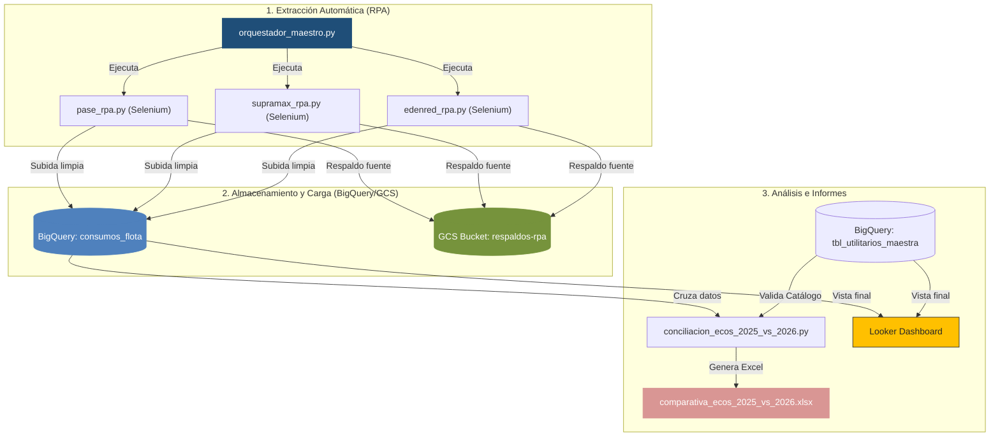

# 🤖 RPA Utilitarios: Ingestión, Conciliación y Reportes Financieros

> [!NOTE]
> Este proyecto automatiza la extracción de consumos de combustible, peajes y mantenimientos de vehículos utilitarios, centralizando los datos en **Google BigQuery** y **Google Cloud Storage (GCS)**, y generando reportes analíticos automatizados.

---

## 🗺️ Arquitectura de Datos e Ingestión

A continuación se muestra el flujo operativo y tecnológico del sistema, desde la extracción automática por RPA hasta la generación de reportes e integración con el Dashboard:



---

## 📂 Clasificación de Scripts: Operativos vs. Utilidades

Para mantener el repositorio limpio y profesional, hemos clasificado los archivos para que distingas los procesos recurrentes de las utilidades especiales:

### 🚀 1. Scripts Operativos (Uso Mensual / Diario)
Estos scripts forman parte del flujo de producción.

| Script | Ubicación | Descripción | Comando de Ejecución |
| :--- | :--- | :--- | :--- |
| **Orquestador Maestro** | [`orquestador_maestro.py`](file:///Users/azulvioleta/Downloads/RPA_Utilitarios/orquestador_maestro.py) | Corre secuencialmente la extracción RPA de Pase, Supramax y Edenred para el **mes anterior** al actual, realiza la ingesta en BigQuery y genera un log de ejecución local. | `python orquestador_maestro.py` |
| **Conciliador de ECOs** | [`scripts/conciliacion_ecos_2025_vs_2026.py`](file:///Users/azulvioleta/Downloads/RPA_Utilitarios/scripts/conciliacion_ecos_2025_vs_2026.py) | Genera el reporte comparativo estético de Excel (`comparativa_ecos_2025_vs_2026.xlsx`) con 7 hojas incluyendo desglose de sistemas, resumen YTD y validación completa de catálogo. | `python scripts/conciliacion_ecos_2025_vs_2026.py --mes 5` |

---

### 🗄️ 2. Scripts de Soporte y Carga de Históricos (De una Sola Vez)
Utilidades especiales para poblar bases de datos con históricos de 2025 o realizar migraciones puntuales.

| Script | Ubicación | Descripción | Comando de Ejecución |
| :--- | :--- | :--- | :--- |
| **Recuperar Pase 2025** | [`scripts/recuperar_pase_2025.py`](file:///Users/azulvioleta/Downloads/RPA_Utilitarios/scripts/recuperar_pase_2025.py) | Descarga todos los CSV históricos del 2025 de Pase desde el bucket de respaldos en GCS, corrige el column-shifting y los sube limpios a BigQuery. | `python scripts/recuperar_pase_2025.py` |
| **Recuperar Edenred 2025** | [`scripts/recuperar_edenred_2025.py`](file:///Users/azulvioleta/Downloads/RPA_Utilitarios/scripts/recuperar_edenred_2025.py) | Descarga e ingesta los reportes históricos del 2025 de Edenred desde GCS, forzando tipos y resolviendo traslapes de fechas. | `python scripts/recuperar_edenred_2025.py` |
| **Backfill Histórico 2026** | [`scripts/backfill_historico.py`](file:///Users/azulvioleta/Downloads/RPA_Utilitarios/scripts/backfill_historico.py) | Permite recargar meses específicos del 2026 para cualquiera de los tres sistemas operativos (`--pase`, `--supramax`, `--edenred`). | `python scripts/backfill_historico.py --pase --mes 2026-01` |
| **Unificar Respaldos** | [`scripts/unificar_respaldos.py`](file:///Users/azulvioleta/Downloads/RPA_Utilitarios/scripts/unificar_respaldos.py) | Descarga todos los archivos del bucket de GCS y genera archivos consolidados locales de Edenred, Supramax y Pase. | `python scripts/unificar_respaldos.py` |
| **Migrar a GCS** | [`scripts/migrar_respaldos_a_gcs.py`](file:///Users/azulvioleta/Downloads/RPA_Utilitarios/scripts/migrar_respaldos_a_gcs.py) | Sube archivos de respaldo locales de forma masiva a la estructura de carpetas en Google Cloud Storage. | `python scripts/migrar_respaldos_a_gcs.py` |
| **Conciliar contra Manual** | [`scripts/conciliar_contra_manual.py`](file:///Users/azulvioleta/Downloads/RPA_Utilitarios/scripts/conciliar_contra_manual.py) | Compara la base de datos de BigQuery contra el archivo de Excel de control interno manual provisto por administración. | `python scripts/conciliar_contra_manual.py` |

---

## 🛠️ Guía de Ejecución Rápida

### 1. Entorno y Configuración

> [!IMPORTANT]
> Asegúrate de tener tu entorno virtual activo y configurado antes de ejecutar cualquiera de los scripts.

```bash
source .venv/bin/activate
pip install -r requirements.txt
```

Tu archivo `.env` en la raíz del proyecto debe tener las credenciales correctas:
```ini
GCP_PROJECT_ID="nombre-de-proyecto"
GCP_BUCKET_RESPALDOS="nombre-de-bucket-respaldos"
BQ_DATASET="rpa_utilitarios"
BQ_TABLE="consumos_flota"

EDENRED_USER="usuario"
EDENRED_PASSWORD="password"
EDENRED_URL="https://..."

PASE_USER="usuario"
PASE_PASSWORD="password"
PASE_URL="https://..."

SUPRAMAX_URL="https://..."
SUPRAMAX_CREDENTIALS='[{"Usuario": "user1", "Contraseña": "pass1", "Empresa": "EMPRESA1"}, ...]'

TWOCAPTCHA_API_KEY="tu_api_key_de_2captcha"
DESTINATARIO_EMAIL="correo@empresa.com"
```

---

### 2. Cómo correr los Procesos Operativos

#### A. Ejecución Mensual Automática
Para correr el RPA completo (Pase ➡️ Supramax ➡️ Edenred) para el mes anterior completo:
```bash
python orquestador_maestro.py
```

> [!TIP]
> **Salida de Logs:** El orquestador redirecciona automáticamente toda la salida de pantalla y errores a un archivo dentro de la carpeta `logs_orquestador/` (ej. `logs_orquestador/orquestador_20260602_171500.txt`).
> **Capturas en caso de error:** Si alguna página da error o timeout, se guardará un `.png` y un `.html` en `descargas_temporales/`.

#### B. Generar el Reporte de Conciliación
Para generar el libro de Excel comparativo con 2025 para un mes en particular (ej. Enero = `1`, Mayo = `5`):
```bash
python scripts/conciliacion_ecos_2025_vs_2026.py --mes 5
```
* **Salida**: Crea o actualiza el archivo `comparativa_ecos_2025_vs_2026.xlsx` en la raíz del proyecto.

---

## 🔒 Seguridad e Ignorados
El archivo `.gitignore` está configurado para no subir datos sensibles ni basura al repositorio de código:
* **No versionar**: `.env`, perfiles de Chrome (`chrome_profile/`, `edenred_profile/`), archivos temporales descargados (`descargas_temporales/`), descargas de GCS (`descargas_gcs/`), logs de ejecución (`logs_orquestador/`), ni los archivos Excel generados (`*.xlsx`, `*.csv`).
